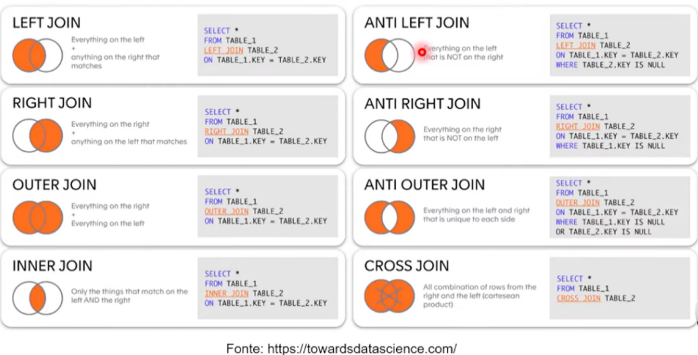

# Percurso

- Etapa 1 - Modelo Relacional e Mapeamento ER/Relacional
- Etapa 2 - Primeiros Passos Com SQL
- Etapa 3 - Explorando Queries Com SQL
- Etapa 4 - Criando Queries com Funções e Cláusulas de Agrupamento
- Etapa 5 - Agrupando Registros e Tabelas com Join 

## Definição

- DDL - Data Definition Language ->     Create, Drop, Insert, Rename...
- DML - Data Manipulation Language ->   Insert, Update, Delete, Merge
- DCL - Data Control Language ->        Grant, Revoke
- DQL - Data Query Language ->          Select

## Mapeando

- Design Lógico do Projeto
- Mapeamento do Modelo de dados

## Resumo

- Modelo ER (Modelo Relacional)
    - Entidade
        - Relação (Entidade)
    - Relação 1:1 ou 1:N
        - FK ou relação
    - Relação M:N
        - Relação ou 2 FKs
    - Relacionamento N-ário
        - Relação ou N FKs
    - Atributo Simples
        - Atributo
    - Atributos Composto
        - Conjunto de atributos
    - Atributo Multivalorado
        - Relação ou FK
    - Conjunto de valores
        - Domínio
    - Atributo chave
        - PK (Ou Secundária)

### Aplicando o conceito na prática...

# Diagrama de Entidade e Relacionamento (DER): 

 

# Teoria dos Conjuntos:

# Desafio De Projeto:

1. Mapeamento do esquema ER para Relacional
2. Definição do script SQL para criação do esquema de banco de dados
3. Persistência de dados para teste
4. Recuperação de informações com queries SQL
5. Não há um mínimo de queries a serem realizadas
6. Os tópicos supracitados devem estar presentes nas queries
7. Elabore perguntas que podem ser respondidas pelas consultas
8. As cláusulas podem estar presentes em mais de uma query
9. Após a criação do esquema lógico, realize a criação do Script SQL para criação do esquema do banco de dados. Posteriormente, realize a persistência de dados para realização de testes. Especifique ainda queries mais complexas do que apresentadas durante a explicação do desafio.
10. Sendo assim, crie queries SQL com as cláusulas abaixo: 
    - Recuperações simples com SELECT Statement
    - Filtros com WHERE Statement
    - Crie expressões para gerar atributos derivados
    - Defina ordenações dos dados com ORDER BY
    - Condições de filtros aos grupos - HAVING Statement
    - Crie junções entre tabelas para fornecer uma perspectiva mais complexa dos dados

# Objetivo:

[Relembrando] Aplique o mapeamento para o  cenário:

“Refine o modelo apresentado acrescentando os seguintes pontos”

- Cliente PJ e PF – Uma conta pode ser PJ ou PF, mas não pode ter as duas informações;
- Pagamento – Pode ter cadastrado mais de uma forma de pagamento;
- Entrega – Possui status e código de rastreio;

### Algumas das perguntas que podes fazer para embasar as queries SQL:

- Quantos pedidos foram feitos por cada cliente?
- Algum vendedor também é fornecedor?
- Relação de produtos fornecedores e estoques;
- Relação de nomes dos fornecedores e nomes dos produtos;